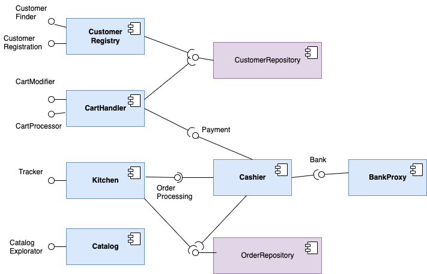

# A Very Simple Cookie Factory

A very simple cookie factory, in Spring, with in-memory repositories, and only cucumber BDD scenarios.

* Author: Philippe Collet
* with reviews from Anne-Marie Déry and Nassim Bounouas
* some code and doc borrowed from the original Cookie Factory by Sebastiem Mosser, last fork being [https://github.com/collet/4A_ISA_TheCookieFactory](https://github.com/collet/4A_ISA_TheCookieFactory)

## Build and run

Configuration: 

* Maven >=3.8.5
* Java >=17
* The rest is handled by pom dependencies (SpringBoot 2.7.5, Cucumber 7.9.0)

Build and run all tests using the command:

    mvn clean package
    
## Architecture

With no Web-oriented controllers and no real persistence, the system has only two layers:

* Spring based components (in blue) implementing the business logic
* In-memory Spring based repositories (in purple) implemeting repositories with an abstraction close to the Domain-Driven Design principles

<p align="center">
  
</p>

### Functional interfaces

To deliver the expected features, the coD system defines the following interfaces:

  * `CartModifier`: operation to modify a given customer's cart, by updating the number of cookies in it, 
  * `CartProcessor`: operations for retrieving the contents of the cart and validating the cart to process the associated order;
  * `CustomerFinder`: a _finder_ interface to retrieve a customer based on her identifier (here simplified to her name);
  * `CustomerRegistration`: operations to handle customer's registration (users profile, ...)
  * `CatalogueExploration`: operations to retrieve recipes available for purchase in the CoD;
  * `OrderProcessing`: process an order (kitchen order lifecycle management);
  * `Payment`: operations related to the payment of a given cart's contents;
  * `Tracker`: order tracker to retrieve information about the current status of a given order.
  * `Bank`: operations that act as proxies to a potential external bank service.

### Business objects

The business objects are simple:

<p align="center">
  
</p>

## Business Components

We focus here on the implementation of a first component, dedicated to handle customer's carts, enables to show the main mechanisms of the business component layer.

### Provided Interfaces

The component is very basic, still we apply interface segregation with two interfaces:

  * `CartModifier`: operations to modify a given customer's cart, like adding or removing cookies. We decide to provide a general purpose `update`method:


```java
  public interface CartModifier {

    int update(Customer retrieveCustomer, Item it) throws NegativeQuantityException;

}
```

  * `CartProcessor`: operations for retrieving the contents of the cart and validating the cart to process the associated order;

```java
public interface CartProcessor {

    Set<Item> contents(Customer c);

    double price(Customer c);

    Order validate(Customer c) throws PaymentException, EmptyCartException;

}
```

Nothing special is needed on these interfaces. They are plain Java. They are simply going to be implemented by the component to be provided by it.

### Business Component and Required Interfaces

The `CartHandler` component is a Java class that implements both interfaces while being annotated with `@Component`. This annotation will enable the Spring container to create all found components (by default as singleton) when initializing the container.

Required interfaces for implementing customers' carts are `Payment` to process the cart for payment and `CustomerRepository`, a kind of mocked implementation for the pure volatile release of the system.  It must be noted that the implementation extends a generic interface that ressembles the *Repository* concept in Domain-Driven Design.

Both interfaces are used in the delcaration for two attributes of the component.
The `@Autowired` annotation is placed on the constructor that initializes both attributes. This annotation will enable the Spring container to inject the reference to the single component implementing this interface when initializing the container. If any `@Autowired` attribute cannot be injected, the Spring container will raise an exception and stop, before any functional calls through interfaces can be triggered.

Note that for component implementation (not testing), it is preferable to inject at the constructor level rather than at the attribute level, so that all dependencies are well initialized at construction time of the component.

```java
@Component
public class CartHandler implements CartModifier, CartProcessor {

    CustomerRepository customerRepository;

    Payment payment;

    @Autowired
    public CartHandler(CustomerRepository customerRepository, Payment payment) {
        this.customerRepository = customerRepository;
        this.payment = payment;
    }
```

### Business Logic

The `update` method implementation is checking the consistency of the request, e.g., that someone is not removing too much cookies from the cart, and is throwing an exception if needed. It notably reuses the `contents` method to get the set of Item from the given Customer.

One interesting implementation is the `validate` method. It first checks that the cart is not empty (or throws EmptyCartException), then delegates the payment to the `cashier` through the required interface, gets an `Order` object from it (or a PaymentException), clears the content of the cart and return the `Order`. Here the `Payment` interface enables the logic in this component to be restricted to its own responsibility: *I check for the cart, someone else handles payment and I get back a created Order I just have to forward back.* I don't care about which component is actually serving the `Payment`.

**This is really the essence of component-based software.**

```java
    @Override
    public Order validate(Customer c) throws PaymentException, EmptyCartException {
        if (contents(c).isEmpty())
            throw new EmptyCartException(c.getName());
        Order newOrder = payment.payOrder(c, contents(c));
        c.setCart(new HashSet<>());
        customerRepository.save(c,c.getId());
        return newOrder;
    }
```

## Testing

### Basic Testing: the `Catalog` Component

We focus here on the implementation of a first very simple component that contains the catalog of cookie recipes. The implementation is really straightforward with only two methods, one to list all recipes, the other one to find recipes matching a given string.
As a result, writing the functiona parts of the tests for the two methods is rather simple (see [CatalogTest](../backend/src/test/java/fr/univcotedazur/simpletcfs/components/CatalogTest.java)):

```java
    @Test
    void listPreMadeRecipesTest() {
        Set<Cookies> premade = catalog.listPreMadeRecipes();
        assertEquals(3, premade.size());
    }

    @Test
    void exploreCatalogueTest() {
        assertEquals(0, catalog.exploreCatalogue("unknown").size());
        assertEquals(2, catalog.exploreCatalogue(".*CHOCO.*").size());
        assertEquals(1, catalog.exploreCatalogue(Cookies.DARK_TEMPTATION.name()).size());
    }
```

This code is purely functional, assuming a `catalogExplorator` (the interface, no one cares about the concrete implementation). However, as the Catalog implementation is going to be a component, its lifecycle is going to be handled by the Spring container. It is not your responsibility anymore to instantiate components when in Spring.

The test setup is also straightforward as the `Catalog`component has no required interface. You only need to annotate the Test class with `@SpringBootTest` so that everything is setup by the SpringBoot test container:

* A specific test container is started. By default, it will find all components like the main container.
* All other specific wirings with JUnit 5, Mockito, etc. are done by the Spring test container. If a framework is not directly supported, it is likely to provide an extension annotation that you will have to add on the class.

Then the only additional setup is to inject (with `@Autowired`) the component under test in the class. As a result, it really looks like an average Spring implementation of a component.

```java
@SpringBootTest
class CatalogTest {

    @Autowired
    Catalog catalog;
```

### Testing the `CartHandler` Component

Let's now focus on the implementation of a more complex component, dedicated to handle customer's carts.

The previously implemented component should ensure the four following properties: (i) the cart of a given customer is empty by default, (ii) adding multiple items results in a cart containing such items, (iii) one can remove cookies from a cart and finally (iii) one can modify the already existing quantity for a given item. Considering a reference on each of two interfaces, it is again quite simple to write some tests to cover the functionalities.

```java
    @Test
    public void addItems() throws NegativeQuantityException {
        cartModifier.update(john, new Item(Cookies.CHOCOLALALA, 2));
        cartModifier.update(john, new Item(Cookies.DARK_TEMPTATION, 3));
        Set<Item> oracle = Set.of(new Item(Cookies.CHOCOLALALA, 2), new Item(Cookies.DARK_TEMPTATION, 3));
        assertEquals(oracle, cartProcessor.contents(john));
    }

    @Test
    public void removeItems() throws NegativeQuantityException {
        cartModifier.update(john, new Item(Cookies.CHOCOLALALA, 2));
        cartModifier.update(john, new Item(Cookies.CHOCOLALALA, -2));
        assertEquals(0, cartProcessor.contents(john).size());
        cartModifier.update(john, new Item(Cookies.CHOCOLALALA, 6));
        cartModifier.update(john, new Item(Cookies.CHOCOLALALA, -5));
        Set<Item> oracle = Set.of(new Item(Cookies.CHOCOLALALA, 1));
        assertEquals(oracle, cartProcessor.contents(john));
    }

    @Test
    public void removeTooMuchItems() throws NegativeQuantityException {
        cartModifier.update(john, new Item(Cookies.CHOCOLALALA, 2));
        cartModifier.update(john, new Item(Cookies.DARK_TEMPTATION, 3));
        Assertions.assertThrows( NegativeQuantityException.class, () -> {
            cartModifier.update(john, new Item(Cookies.CHOCOLALALA, -3));
        });
        Set<Item> oracle = Set.of(new Item(Cookies.CHOCOLALALA, 2), new Item(Cookies.DARK_TEMPTATION, 3));
        assertEquals(oracle, cartProcessor.contents(john));
    }

    @Test
    public void modifyQuantities() throws NegativeQuantityException {
        cartModifier.update(john, new Item(Cookies.CHOCOLALALA, 2));
        cartModifier.update(john, new Item(Cookies.DARK_TEMPTATION, 3));
        cartModifier.update(john, new Item(Cookies.CHOCOLALALA, 3));
        Set<Item> oracle = Set.of(new Item(Cookies.CHOCOLALALA, 5), new Item(Cookies.DARK_TEMPTATION, 3));
        assertEquals(oracle, cartProcessor.contents(john));
    }
```

We can then start to configure our test class just like in the `CatalogTest`. We annotate the class and we inject the two interfaces:

```java
@SpringBootTest
class CarthandlerTest {

    @Autowired
    private CartModifier cartModifier;

    @Autowired
    private CartProcessor cartProcessor;
```

But wait, we also need to setup a proper environment (note that we are not mocking anything yet, check the next section for that). We can use `@BeforeEach` from JUnit 5, create a customer John, through the appropriate interfaces (`CustomerRegistration` for registration, `CustomerFinder` to get the instance). To ensure test independance, we are also going to flush all the data in memory through the `CustomerRepository`. So we just have to inject all those interfaces and to declare a Customer attribute for the object we use as input data.


```java
    @Autowired
    private CustomerRepository customerRepository;

    @Autowired
    private CustomerRegistration customerRegistration;

    @Autowired
    private CustomerFinder customerFinder;

    private Customer john;

    @BeforeEach
    void setUp() throws AlreadyExistingCustomerException {
        customerRepository.deleteAll();
        customerRegistration.register("John", "credit card number");
        john = customerFinder.findByName("John").get();
    }
```

### Mocking

In the previous test, the CartHandler component was tested through its two provided interfaces, but it has also required interfaces. Actually, the Spring test container was behaving like the normal one, looking for dependencies (`@Autowired`) recursively. So the `Cashier` component was created, injected through its interface `Payment` inside `Cart`, and so on for the `BankProxy` created and connected to `Cashier`.

Now let's test the `Cashier` component, which provides the `Payment` interface with a single method `Order payOrder(Customer customer, Set<Item> items) throws PaymentException;`. It looks easy, we should write a test to get the Order if the payment is going well, and another one in case the payment is rejected with the method throwing `PaymentException`.

```java
    @Test
    public void processToPayment() throws Exception {
        // paying order
        Order order = cashier.payOrder(john, items);
        assertNotNull(order);
        assertEquals(john, order.getCustomer());
        assertEquals(items, order.getItems());
        double price = (3 * Cookies.CHOCOLALALA.getPrice()) + (2 * Cookies.DARK_TEMPTATION.getPrice());
        assertEquals(price, order.getPrice(), 0.0);
        assertEquals(2,order.getItems().size());
    }

    @Test
    public void identifyPaymentError() {
        Assertions.assertThrows( PaymentException.class, () -> {
            cashier.payOrder(pat, items);
        });
    }
```

The main issue here is that the `Cashier` reuses the `BankProxy`, which itself is likely to call an external bank system (this is not the case but its implementation is too basic to test all cases).
It is clearly a use case for mocking. Here the easiest way to write the test is to mock the required interface (and the component that should have been implemeting this interface). In our case, this is the `Bank` interface, so it will be declared as an attribute with the `@MockBean` annotation instead of the `@Autowired`. `@MockBean` fait appel à Mockito bien intégré avec le framework de test Spring (et donc le container de test Spring):

```java
@SpringBootTest
class CashierTest {

    @Autowired
    CustomerRepository customerRepository;

    @Autowired
    private Payment cashier;

    @MockBean
    private Bank bankMock;

    // Test context
    private Set<Item> items;
    Customer john;
    Customer pat;
```

Consequently, it enables one to write a test setup with Mockito directives (e.g. `when`and `thenReturn`) other the mocked interface. In our case, the mock is a bit smart, accepting (with true) the payment if the payer is John, and rejecting it if the payer is Pat.

```java
    @BeforeEach
    public void setUp() throws Exception {
        customerRepository.deleteAll();
        // We could also use below the customerRegistry component to setup the test environment
        items = new HashSet<>();
        items.add(new Item(Cookies.CHOCOLALALA, 3));
        items.add(new Item(Cookies.DARK_TEMPTATION, 2));
        // Customers
        john = new Customer("john", "1234-896983");
        customerRepository.save(john, john.getId());
        pat  = new Customer("pat", "1234-567890");
        customerRepository.save(pat, pat.getId());
        // Mocking the bank proxy
        when(bankMock.pay(eq(john), anyDouble())).thenReturn(true);
        when(bankMock.pay(eq(pat),  anyDouble())).thenReturn(false);
    }
```

### BDD in Spring

Behavioral-Driven Development (BDD) bridges the gap between scenarios, which could be very close, in the Gherkin syntax, to acceptance criteria, and tests. This enables to mechanize tests that follows use cases or acceptance criteria from a user story.

We consider here several tests so that we have a setup that can handle many of them in a proper way.

#### Setting-up Cucumber

The setup is done through a bom (bill of materials in maven pom).

We just have to add the following dependencies in the POM file (versions are using properties in the code):

```xml
  <properties>
		...
		<cucumber.version>7.9.0</cucumber.version>
  </properties>

	<dependencyManagement>
		<dependencies>
			<dependency>
				<groupId>io.cucumber</groupId>
				<artifactId>cucumber-bom</artifactId>
				<version>${cucumber.version}</version>
				<type>pom</type>
				<scope>import</scope>
			</dependency>
		</dependencies>
	</dependencyManagement>
	
	...
			<dependency>
			<groupId>io.cucumber</groupId>
			<artifactId>cucumber-java</artifactId>
		</dependency>
		<dependency>
			<groupId>io.cucumber</groupId>
			<artifactId>cucumber-junit-platform-engine</artifactId>
			<scope>test</scope>
		</dependency>
		<dependency>
			<groupId>io.cucumber</groupId>
			<artifactId>cucumber-spring</artifactId>
			<scope>test</scope>
		</dependency>
		<dependency>
			<groupId>org.junit.platform</groupId>
			<artifactId>junit-platform-suite</artifactId>
			<scope>test</scope>
		</dependency>
```

#### Modelling use cases or scenarios as Features

We consider first the use case "Ordering cookies" that is more or less the one used for testing the CartHandler:

  1. Considering a customer that exists in the system.
  2. The customer add some cookies to her cart.
  3. The cart is updated (and remove duplicates, if any).
  4. The cart is validated, paid (and the order is created).

The Use case _Ordering cookies_ is modelled as a `Feature`, and described using ([Gherkin](https://cucumber.io/docs/gherkin/)], a requirement language based on the _Given, When, Then_ paradigm. We create a file named `OrderingCookies.feature`, where we describe an instance of this very scenario:

```gherkin
Feature: Ordering Cookies

  This feature supports the way a Customer can order cookies through a cart

  Background:
    Given a customer named "Maurice" with credit card "1234896983"
    
  Scenario: Modifying the number of cookies inside an order
    When "Maurice" orders 2 x "CHOCOLALALA"
    And "Maurice" orders 3 x "DARK_TEMPTATION"
    And "Maurice" orders 3 x "CHOCOLALALA"
    And "Maurice" asks for his cart contents
    Then there are 2 items inside the cart
    And the cart contains the following item: 5 x "CHOCOLALALA"
    And the cart contains the following item: 3 x "DARK_TEMPTATION"
```

A `Scenario` contains several steps. A `Given` one represents the context of the scenario, a `When` one the interaction with the SuT (_system under test_) and a `Then` is an assertion expected from the SuT. The `Background` section is a sub-scenario that is common to all the others, and executed before their contents.

To implement the behaviour of each steps, we can rely on a testing frameork, e.g., JUnit. We create a test class named `OrderingCookies`, where each step is implemented as a method. The matching that binds a step to a test method is reified as classical regular expressions (e.g. `(\\d+) for an integer`) or as specific Cucumber expression (e.g. {string} for a string between double quotes).  Method parameters correspond to each matched expression, one after another.

*Note that for easing the configuration process, the feature file and the implementation step class are placed in the same hierarchy, one inside `resources` and the other inside `test/java`.

Setting up or cleaning the context is possible through specific Cucumber annotation (e.g. `@BeforeAll`, `@Before`, `@BeforeStep`, `@After`...). Be careful as most of them have the same name as JUnit ones, but they must be imported from the `io.cucumber.java` package.

```java
public class OrderingCookies {

...
    private Customer customer;
    private Set<Item> cartContents;
    private Order order;

    @Before
    public void settingUpContext() throws PaymentException {
        customerRepository.deleteAll();
        orderRepository.deleteAll();
        when(bankMock.pay(any(Customer.class), anyDouble())).thenReturn(true);
    }

    @Given("a customer named {string} with credit card {string}")
    public void aCustomerNamedWithCreditCard(String customerName, String creditCard) throws AlreadyExistingCustomerException {
        customerRegistration.register(customerName, creditCard);
    }

    @When("{string} asks for his cart contents")
    public void customerAsksForHisCartContents(String customerName) {
        customer = customerFinder.findByName(customerName).get();
        cartContents = cartProcessor.contents(customer);
    }

    @Then("^there (?:is|are) (\\d+) items? inside the cart$") // Regular Expressions, not Cucumber expression
    // Note that you cannot mix Cucumber expression such as {int} with regular expressions
    public void thereAreItemsInsideTheCart(int nbItems) {
        assertEquals(nbItems, cartContents.size());
    }
...
```

#### Cucumber-Junit-Spring setup and execution at scale

In Java, the Cucumber framework relies on JUnit, and some specific setup is also necessary. One additional class with enable the configuration of the JUnit 5 runner with a Cucumber specific plugin, and some options (typically the location of the feature files) can be specified:

```java
@Suite
@IncludeEngines("cucumber")
@SelectClasspathResource("features/ordering")
@ConfigurationParameter(key = PLUGIN_PROPERTY_NAME, value = "pretty")
@ConfigurationParameter(key = GLUE_PROPERTY_NAME, value = "fr.univcotedazur.vscf.cucumber.ordering")
public class OrderingCucumberRunnerTest {
}
```

Two issues must be handled to finish the setup and make it work easily with many features and some Spring mocking:

First, for each runner (see above), you need to have one and only configuration class annotated with

```java
@CucumberContextConfiguration
@SpringBootTest
```

If this is setup is placed on the class implementing the steps, there should only be one such class for the runner. Otherwise, you should create one configuration class, like `OrderingCucumberConfig`

```java
@CucumberContextConfiguration
@SpringBootTest
public class OrderingCucumberConfig {

    @Autowired // Bug in the Cucumber/Mockito/Spring coordination: needs to add @Autowired
    @MockBean
    private Bank bankMock;

}
```
Note that all steps definition classes have then no annotations at the class level (see both stepdefs classes in the `cucumber/ordering` package, and check the two separate runner, for ordering and for catalog BDD testing that are provided to show how to separate the configuration.

Second, if you need to use mocks (with `@MockBean`) in the steps definition classes, you need to create them in the configuration class (like in `OrderingCucumberConfig` above) and to add `@Autowired` as these are the known workaround to make Cucumber works with mockito in Spring!


## Smart Logging

### Configuration

Configuration of logs can be done by changing some properties, either by passing them as parameters to maven execution, or by adding them to the `application.properties` file (in the `resources`dir). For example :

    logging.level.root=OFF

would turn off all logs at all levels.

More configuration options are available in a configuration file (and XML file named `logback-spring.xml`). When found by SpringBoot, it is automatically used to configure the way logs are writtent. 

### Testing configuration

On the testing side, the previous configuration will be reused by default, but we could want to tune it better, for example, to focus logs on the most important parts when running tests while reducing the overall log size.

First, we can get rid of the Spring banner and some logs from the test context (except errors) by creating a separate `application.properties` file in the `test/resources` directory:

```
spring.main.banner-mode=off
logging.level.org.springframework=ERROR
```

Then one can add a `logback-test.xml` file in the `test/resources` directory to configure LogBack.

### A smarter logging strategy with AOP

The thing with the basic solution is that it is quite cumbersome. One has to put Logger declaration and statements everywhere. While there are other frameworks that reduces the burden, the technical part of Logging is always the same kind of scenarios:

   * you want to be notified when the program enters a certain set of methods,
   * you want to be notified when the program exits the same set,
   * and you might want to know whether it exits normally or with an exception...

Let's be smart and let's use the Aspect-Oriented Programming (AOP) paradigm to do so. Actually the whole implementation of Spring containers intensively uses AOP implemented with proxies around components to do almost all technical stuff within the Spring framework. The next section gives some elements and pointers to understand the paradigm more deeply, if needed.

As an example, we want to log all public methods in all components so that we have some information on entry and exit (maybe alors when exiting with an exception). With AOP, it will be easy :

1. Include spring-boot-starter-aop in your pom.xml :

```xml
        <dependency>
            <groupId>org.springframework.boot</groupId>
            <artifactId>spring-boot-starter-aop</artifactId>
        </dependency>
```

2. Add `@EnableAspectJAutoProxy` to your configuration class (to tell SpringBoot that you active AspectJ support):

```java
@SpringBootApplication
@EnableAspectJAutoProxy
public class VerySimpleCookieFactoryApplication {
...
```

3. Add a pointcut that defines a pattern that is matched against method signatures as they run (see next section for details) + Add an aspect component that defines when you want to run your code in relation to the pointcut (e.g, before, after the matched methods):

```java
@Aspect
@Component
public class ComponentLogger {

        private static final Logger LOG = LoggerFactory.getLogger(ComponentLogger.class);
        private static final String PREFIX = "VSCF:Component:";

        @Pointcut("execution(public * fr.univcotedazur.vscf.components..*(..))")
        private void allControllerMethods() {} // This enables to attach the pointcut to a method name we can reuse below

        @Before("allControllerMethods()")
        public void logMethodNameAndParametersAtEntry(JoinPoint joinPoint) {
            LOG.info(PREFIX + joinPoint.getThis() + ":Called {}", joinPoint.getSignature().getName() + " " + joinPoint.getArgs());
        }

        @AfterReturning(pointcut = "allControllerMethods()", returning = "resultVal")
        public void logMethodReturningProperly(JoinPoint joinPoint, Object resultVal) {
            LOG.info(PREFIX + joinPoint.getThis() + ":Returned {}", joinPoint.getSignature().getName() + " with value " + resultVal);
        }

        @AfterThrowing(pointcut = "allControllerMethods()", throwing = "exception")
        public void logMethodException(JoinPoint joinPoint, Exception exception) {
            LOG.warn(PREFIX + joinPoint.getThis() + ":Exception from {}", joinPoint.getSignature().getName() + " with exception " + exception);
        }
```

In our case, the `@Pointcut` annotation defines, through the AspectJ syntax, the signature of methods that are going to be "intercepted". The the name of the annotated method (`allComponentsMethods()`) will be used as a reference for three *advices* :

   * One before the method, which uses the `JoinPoint` object to log the caller object (the component object) and all the parameter values being passed;
   * One after if the method exits correctly;
   * One after an exception throwing, which changes the log level to WARNING when logging.

As a result, all component implementations (`@Component` classes in the `components` package) have their public methods logged with only this setup!


